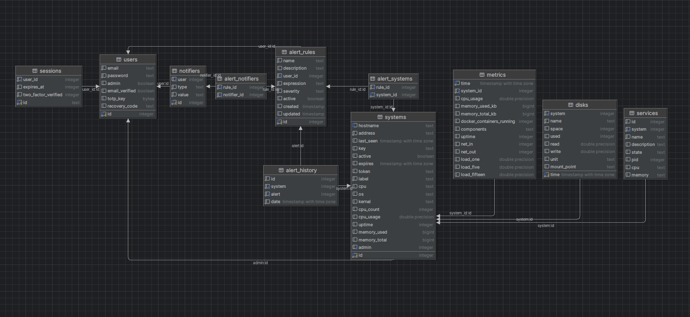

# Lynx

A lightweight and beautiful server monitoring service.

Comes with a sleek and user friendly web interface allowing you to deploy agents, setup alerts, and view
statistics/historical data.

## About

Lynx consists of three main services and a Postgress DB.

- lynx-agent (Individual binary to deploy on wanted servers)
- lynx-core (Central server that collects metrics and manages notifications)
- lynx-portal (Frontend app to visualize data)

The lynx-agent uses gRPC to send system info and metrics to the lynx-core. The agents also expose a websocket connection
for remote updates and command streams.

The lynx-portal is a small Svelte application that connects to the database for historical data, and connects to the
agents for command streaming and real-time data.

## Features

- **Modular**: All services including the database, hub, agents, and portal can all be hosted on seperate services
- **System Stats**: Agents track system information including cpu usage, memory stats, disk usage & I/O, network
  information, temperature statistics, etc.
- **System Services**: Agents track systemctl services allowing you to start, restart, and monitor them from the hub
- **Docker Containers**: Agents track active docker containers as well as individual container information
- **Alerts**: The portal allows you to set up alerts using various services (email, discord, telegram, etc.) using a
  variety of triggers (cpu usage, memory usage, disk usage, service down, etc.)
- **Remote Commands**: The portal allows you to execute bash commands on agents remotely

## Installing the hub

====UNDER CONSTRUCTION====

## ERD

    
